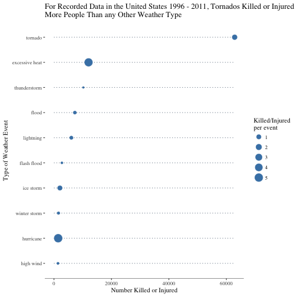

## An Analysis of the Personal and Economic Impacts of Storm Events in the United States
Andrew Fox

### Synopsis
The following analysis is desgined to investigate the population health and economic impacts of various types of storm event in the United States.  The report is based on data from the National Oceanic and Atmospheric Administration's (NOAA) storm database [availble here (47Mb)](https://d396qusza40orc.cloudfront.net/repdata%2Fdata%2FStormData.csv.bz2) which includes records of extreme weather events across the United States from 1950 to 2011.  The aim of the analysis is to report the type of storm events that have the greatest economic and population health impacts.
  
For the purposes of this analysis the data is fairly incomplete prior to 1996 as the full suite of weather events were not being recorded, there are also a large number of missing datapoints from earlier in the data particularly related to the value of damage to crops / property.  The first stage of this analysis is therefore to exclude datapoints that are incomplete or not useful to us, the dataset is then split into human impact and economic impact to allow for individual analysis of each.  There will be 2 sets of results at the end of the report, the first adressing the event type that has had the greatest impact on population health and the second the weather type that has had the greatest economic impact.

The data used in this report is supplied *as-is* and is assumed to be an accurate, complete and representative sample of weather events in the United States over the time period, more information on the database can be found in the [documentation](https://d396qusza40orc.cloudfront.net/repdata%2Fpeer2_doc%2Fpd01016005curr.pdf) or in the [FAQ](https://d396qusza40orc.cloudfront.net/repdata%2Fpeer2_doc%2FNCDC%20Storm%20Events-FAQ%20Page.pdf) supplied by the NOAA.

### Data Processing
This part of the analysis requires the following packages:

```r
library(tidyverse) # For data manipulation
library(lubridate) # For datetime parsing
library(magrittr) # For pipe notation (tidyverse is yet to incorporate the compound assignment pipe operator %<>%)
library(stringr) # For string manipulation
```

The first step is to read in the dataset, this can be done directly from its compressed format using the `read_csv()` function.

```r
data <- read_csv('data/repdata%2Fdata%2FStormData.csv.bz2')
```

```r
dim(data)
```

```
## [1] 902297     37
```

```r
sum(is.na(data))
```

```
## [1] 6875959
```
We immediately see that there are 902297 rows, 37 variables and ~6.8 million missing values in the dataset.

The intital processing of the data will include removing dates prior to 1996. Before this point not all possible event types were recorded (in early records it appears only tornados were captured).  If we were to include this information then there is a risk that it could cause bias in any results published that include totals as there would be a misrepresentation of the number of each event.  We will then select only the relevant variables for the analysis to minimise the size of the dataframe:


```r
data$BGN_DATE <- mdy_hms(data$BGN_DATE) # convert begin time variable to datetime to allow for filtering

data %<>%
        filter(BGN_DATE >= 1996) %<>% # Filter dates
        select(EVTYPE, FATALITIES, INJURIES, PROPDMG:CROPDMGEXP) # Select variables
```

There is a large volume of variability in the event type variable.  A large amount of time could be spent at this stage correcting individual entries however as we are only concerned with the most impactful (and by proxy most common) events I will keep my manipulation of this variable to a minimum. The level of manipulation required here depends on what you are trying to analyse but is also subjective, the NOAA identifies 48 possible storm types that vary from the very common to the very rare and even this 48 could be further reduced to more generalised types if desired.

The first step is to force all observations to the same lower case for consistency. I then identified a few common and repeated errors in reporting that I correct using the `stringr` package.  The reasoning behind the changes are that there are numerous observations where events are identifed by name (e.g. 'hurricane katrina') these are combined into one category for hurricanes.  I have also removed subcategories from events such as 'winter storm'. Another alteration was to combine hurricane and typhoon into a single 'hurricane' category.  These are the same event with differences being atributable to variations in naming convention across locations.[^1]

[^1]: [*'What is the difference between a hurricane, a cyclone, and a typhoon?'*](https://oceanservice.noaa.gov/facts/cyclone.html) 


```r
data$EVTYPE <- tolower(data$EVTYPE) # Force entries to lowercase
data$EVTYPE %<>% # Replace some common event type inconsistencies
        str_replace_all('^winter storm.*', 'winter storm') %<>%
        str_replace_all('^thunderstorm.*', 'thunderstorm') %<>%
        str_replace_all('^tstm.*', 'thunderstorm') %<>%
        str_replace_all('^tropical storm.*', 'tropical storm') %<>%
        str_replace_all('^hurricane.*', 'hurricane') %<>%
        str_replace_all('^heat.*', 'excessive heat') %<>%
        str_replace_all('river flood', 'flood')
```

The next stage is to create specific datasets for human and economic impacts.  This allows us to be more selective about the data that we use for each question.

#### 1 - Population Health Impact
For this data set there is no missing data across the variable we need for the evaluation so I will keep the data intact. Simply grouping by the event type and creating a summary statistic of the total number of people killed or injured will suffice.  I also create a statistic of the number of people killed or injured per each instance of an event so we can see not only which type of event has the biggest overall impact but can also see which type of weather is the most dangerous per instance.  Lastly because we are only interested in the most impactful events I reduce the data to the top 10 event types to make the results easier to observe.

```r
# Create dataframe of total impact (injuries + fatalities)
human <- data %>%
                group_by(EVTYPE) %>% # Group to event type
                summarise(human_impact = sum(INJURIES) + sum(FATALITIES),
                          `Killed/Injured\nper event` = human_impact / n()) %>%
                arrange(desc(human_impact)) # Arrange by most impactful

human <- head(human, 10) # Select only the top 10
```

#### 2 - Economic Impact
Calculating the economic impact each weather event is a little more complex due to the structure of the data.  It is split out into the cost of damage to property ```PROPDMG``` and the cost of damamge to crops ```CROPDMG```.  The exponent of the figure given is then given in a seperate column ```PROPDMGEXP``` / ```CROPDMGEXP```.  This variable is used to express both the exponent and also in some cases a level of confidence in the accuracy.  Exponents are given either as a number [0-9] or a letter (k, m, b) indicating thousand, million and billion respectively.  There are also inconsistencies in case usage which must also be corrected as well as a large amount of missing values.

The order of my processing is in the code below however broadly speaking I coerced the exponents to lower case first then removed all ```NA``` values from the data as well as the 28 points marked with a '?' indicating uncertainty in the record.  I then used the ```str_replace_all()``` function from the ```stringr``` package to replace the letters with corresponding exponent values.  At this point I was able to process the data into a summary dataframe by raising the value in the damage column by its exponent to get the value.  I then combined the property and crop damage values for each event before grouping the data by event type.  I could then create summary statistics for both the total value of damage per event type as well as the average cost of damage per event.  I then reduced the data to the top 10 event types:

```r
data$PROPDMGEXP <- tolower(data$PROPDMGEXP) # Convert exponents to consistant case
data$CROPDMGEXP <- tolower(data$CROPDMGEXP)

economic <- data %>%
                filter(!is.na(PROPDMGEXP) & !is.na(CROPDMGEXP)) %>%  # Filter NA
                filter(CROPDMGEXP != '?') # Remove innaccurate damage estimates (few in set)

repl <- c('k' = '3', 'm' = '6', 'b' = '9') # Create string to replace exponents
economic$PROPDMGEXP %<>% str_replace_all(repl) # Replace exponent in property damage
economic$PROPDMGEXP <- as.integer(economic$PROPDMGEXP) # Force to integer value
economic$CROPDMGEXP %<>% str_replace_all(repl) # Replace exponent in crop damage
economic$CROPDMGEXP <- as.integer(economic$CROPDMGEXP) # Force to integer value

economic %<>% # Create summary dataframe
        mutate(property = as.numeric(PROPDMG * (10^PROPDMGEXP)), # Total property damage
               crops = as.numeric(CROPDMG * (10^CROPDMGEXP)), # Total crops damage
               damage = property + crops) %<>% # Total damage overall
        group_by(EVTYPE) %<>% 
        summarise(damage = sum(damage) / 1e9,
                  `Cost of damage\nper event (bn USD)` = damage / n()) %<>% # Create summary of damage / event type
        arrange(desc(damage))

economic <- head(economic, 10) # Take top 10 events by damage caused
```

### Results
The next stage is to plot the results.  We start by addressing the first question:

#### Across the United States, which types of events are most harmful with respect to population health?


```r
library(ggplot2) # For data visualisation
library(ggthemes) # Expansion for gglot2


human$EVTYPE <- factor(human$EVTYPE, levels = human$EVTYPE[order(human$human_impact)])
ggplot(human, aes(x = EVTYPE, y = human_impact)) +
        theme_tufte() +
        geom_segment(aes(x = EVTYPE, xend = EVTYPE,
                         y = 0, yend = max(human_impact)),
                     linetype = 3, colour = 'slategrey') +
        geom_point(aes(size = `Killed/Injured\nper event`), colour = 'steelblue') +
        coord_flip() +
        theme(axis.line.x = element_line(size = 0.2)) +
        labs(title = 'For Recorded Data in the United States 1996 - 2011, Tornados Killed or Injured\nMore People Than any Other Weather Type',
             x = 'Type of Weather Event',
             y = 'Number Killed or Injured')
```



*This plot shows the number of people killed by various weather events, the position on the x-axis indicates the number killed or injured. The size of the point is indicative of the average number killed or injured for each occurence of an event.*

From this visualisation we can see that from 1996 to 2011 tornados killed or injured far more people than any other weather type.  Part of the reason for this is that they are more common than other types. The relative point size indicates that when adjusted for frequency, hurricanes and heat actually have a higher impact per event (I would speculate due to these events usually happening over a wider spatial area than a tornado, where the damage tends to be concentrated around the path).

***
***

#### Across the United States, which types of events have the greatest economic consequences?


```r
economic$EVTYPE <- factor(economic$EVTYPE, levels = economic$EVTYPE[order(economic$damage)])
ggplot(economic, aes(x = EVTYPE, y = damage)) +
        theme_tufte() +
        geom_segment(aes(x = EVTYPE, xend = EVTYPE,
                         y = 0, yend = max(damage)),
                     linetype = 3, colour = 'slategrey') +
        geom_point(aes(size = `Cost of damage\nper event (bn USD)`), colour = 'steelblue') +
        theme(axis.line.x = element_line(size = 0.2)) +
        coord_flip() +
        labs(title = 'For Recorded Data in the United States 1996 - 2011 Flooding has Caused\nSignificantly More Damage by Cost than any Other Weather Type',
             x = 'Type of Weather Event',
             y = 'Damage caused (billion USD)')
```


*This plot shows the total cost (in billions of US Dollars) of damage to property and crops as position of the point on the x-axis and the average cost (in billions of US Dollars) of damage per occurence of that event as the size of the point.*

This output shows that flooding has caused more economic damage than any other type however in a similar vein to the public health impact above the average cost per incidence is higher for another storm type (hurricanes).

***
***

Away from the assignment proper (no need to consider this in marking) I was interested in seeing where these storm events occurred (not being American myself and seeing as the data comes with geographical information).  I selected data between 1996 and 2011 that had killed or injured at least 10 people and mapped it using ```ggmap``` & ```ggplot2```.  This data shows a clear East/West split and could be an interesting jump off point for some further analysis...


```r
library(ggmap)

data <- read_csv('data/repdata%2Fdata%2FStormData.csv.bz2')

data  <- data %>%
        filter(BGN_DATE >= 1996) %<>% # Filter dates
        select(EVTYPE, FATALITIES, INJURIES, PROPDMG:CROPDMGEXP, LATITUDE, LONGITUDE)


data$LONGITUDE <- sub("(..)$", ".\\1", data$LONGITUDE)
data$LONGITUDE <- as.numeric(data$LONGITUDE)
data$LONGITUDE <- -data$LONGITUDE
data$LONGITUDE <- jitter(data$LONGITUDE)

data$LATITUDE <- sub("(..)$", ".\\1", data$LATITUDE)
data$LATITUDE <- as.numeric(data$LATITUDE)
data$LATITUDE <- jitter(data$LATITUDE)

data$EVTYPE <- tolower(data$EVTYPE)

storm <- data %>%
        filter(LATITUDE > 0 & LONGITUDE < 0) %>%
        mutate(`Population Impact` = FATALITIES + INJURIES) %>%
        filter(`Population Impact` > 10)

usa <- ggmap(get_map('united states', zoom = 4, color = 'bw'))

usa + geom_point(data = storm, aes(x = LONGITUDE, y = LATITUDE),
                 size = 1, alpha = 0.3, colour = 'indianred2') +
        theme_map() +
        labs(title = 'Storm events with ten or more people\nkilled or injured USA 1996 - 2011')
```


[^1]:[*'What is the difference between a hurricane, a cyclone, and a typhoon?'*](https://oceanservice.noaa.gov/facts/cyclone.html)
